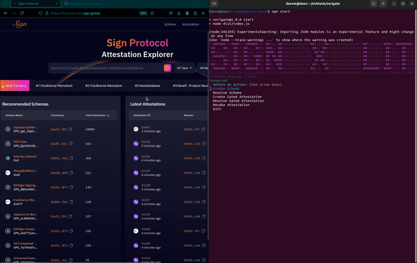

# Sign x Lit

### Demo



### Approach: Integrating Lit Protocol with Sign Protocol's SDK

This section outlines the steps and approach I followed to integrate the Lit Protocol with the Sign Protocol SDK for gated access and encrypted attestations. The focus was on ensuring compatibility while enhancing functionality with Lit's encryption capabilities.

#### Key Steps in the Integration

- Migration to TSC Builder
- Replaced the Rollups builder in the sp-sdk with the native TypeScript (TSC) builder.
- This change resolved compatibility issues between the sp-sdk and Lit Protocol SDK.
- The migration ensures smoother builds and aligns with the evolving requirements of the SDK ecosystem.

#### Support for Gated Access

- Added additional arguments in options like gated, accessControlConditions in create, get and revoke attestations
- Currently, this feature is limited to on-chain attestations only, with plans for broader support in future iterations.

#### Handling Encrypted Attestations

- When an attestation is marked as encrypted the base64 encrypted string and data hash are securely stored on-chain.
- These encrypted values can only be decrypted using the access conditions specified at the time of creation.
- The integration with Lit Protocol ensures robust encryption and access control, leveraging its advanced encryption capabilities.

#### On chain gated attestations

```tsx
import {
  SignProtocolClient,
  SpMode,
  EvmChains,
  delegateSignAttestation,
  delegateSignRevokeAttestation,
  delegateSignSchema,
} from "@ethsign/sp-sdk"
import { privateKeyToAccount } from "viem/accounts"
const privateKey = "0xabc" // optional

const client = new SignProtocolClient(SpMode.OnChain, {
  chain: EvmChains.sepolia,
  account: privateKeyToAccount(privateKey), // optional
})

//create schema
const createSchemaRes = await client.createSchema({
  name: "xxx",
  data: [{ name: "name", type: "string" }],
})

// delegation create schema
const delegationPrivateKey = "0xaaaaa"
const info = await delegateSignSchema(
  {
    name: "xxx",
    data: [{ name: "name", type: "string" }],
  },
  {
    chain: EvmChains.sepolia,
    delegationAccount: privateKeyToAccount(delegationPrivateKey),
  }
)
const delegateCreateSchemaRes = await client.createSchema(info.schema, {
  delegationSignature: info.delegationSignature,
})

// create attestation
const createAttestationRes = await client.createAttestation(
  {
    schemaId: "0x3",
    data: { name: "a" },
    indexingValue: "xxx",
  },
  {
    gated: true, // Enable gated
    accessControlConditions: [
      {
        contractAddress: "0xC5E9dDebb09Cd64DfaCab4011A0D5cEDaf7c9BDb",
        standardContractType: "ProofOfHumanity",
        chain: "ethereum",
        method: "isRegistered",
        parameters: [":userAddress"],
        returnValueTest: {
          comparator: "=",
          value: "true",
        },
      },
    ], // specify access control conditions
  }
)

//revoke attestation
const getAttestationRes = await client.getAttestation("0x3", {
  gated: true,
}) // specify gated to decrypt attestation
```

### Developer Feedback

A detailed feedback can be found [here](https://github.com/EthSign/ethglobal-bangkok-2024-tracker/issues/4)
